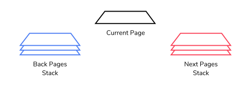

# Stacks
# Web Navigator

This project, Web Navigator, simulates the navigational operations of a web browser such as :
* opening a new web page,
* navigating back a page and
* going forward a page. We will use the Stack class to maintain the history of visited pages with a backPages stack and a nextPages stack.

When we open a new page, we push the previous page on the backPages stack. When we revisit an old page and then visit a new page from there, we clear any content in the nextPages stack.

When we revisit a back page, we push the current page on the nextPages stack. Like the back button and the next button on a web browser, the back page and next page operations can be enabled or disabled depending on the state of the two stacks. For example, if the backPages stack is empty, the back operation is disabled and will be enabled only when the stack has content.

User input is required to:
* enter a new page to be visited,
* navigate backward or forward a page, and
* to quit the program.

The option to navigate forward or backward is conditional depending on user input and the state of the stacks. We will explain this in more detail in the relevant tasks.

At every operation other than quitting, we display information about the current page and the top element of the two stacks

## Initialization
1. The Web Navigator needs two stacks to maintain the history of visited pages.

    * Create a const backPages variable and assign it to a new Stack class to model the history of visited pages
    * Create a const nextPages variable and assign it to a new Stack class to model the pages that get moved when an old page from the backPages stack is revisited.
2. Set the default page to be anything you like. Assign this to a global variable currentPage.

## Helper Functions
3. We will need several helper functions to help us implement the basic operations of this program. Define a function, showCurrentPage() to display the following:
    * the action taken, based on user input
    * the current page,
    * the top element of the backPages stack, and
    * the top element of the nextPages stack.

    This function takes a string parameter, action based on user input.
4. Next, we want to implement what happens when we visit a new page. The new page replaces the current page, hence, the current page has to be moved to the backPages stack as history. The first time we open a new page, the nextPages stack is empty. However, this is not always so when we have navigated back and forth. The expected behavior of a web browser is to always clear the nextPages stack when a new page is visited.

    Define a newPage() function with one parameter, page. Implement the following inside the function:
    * push currentPage to the backPages stack
    * update currentPage to be page
    * clear the nextPages stack
    * show the current page by calling the helper function defined in Task 1

5. The next helper function we want to define is backPage() which is called when we navigate backward a page. This function does not accept any parameter. The steps to implement this function are:
    * push the current page on the nextPages stack as we will no longer display it,
    * remove the top item from the backPages stack and set it as the current page, and
    * display the new current page using the helper function we created in Task 1 and pass an argument to it to denote the back operation.. Hint
6. The last helper function we need is parallel to the backPage() function in Task 5. We will call this function, nextPage(). Try and implement this function as follows:
    * push the current page on the backPages stack as we will no longer display it,
    * remove the top item from the nextPages stack and set it as the current page, and
    * display the new current page using the helper function we created in Task 1 and pass an argument to it to denote the next operation..
