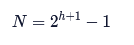
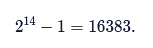
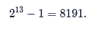

# Heaps
# Heaps: JavaScript

## Introduction
A heap data structure is a specialized tree data structure that satisfies the heap condition:
* In a max-heap, for any given element, its parent’s value is greater than or equal to its value.
* In a min-heap, for any given element, its parent’s value is less than or equal to its value.

A heap data structure is commonly implemented as a binary tree. In this lesson, we’re going to implement a min-heap in JavaScript. Min-heaps efficiently keep track of the minimum value in a dataset, even as we add and remove elements.

Heaps enable solutions for complex problems such as finding the shortest path (Dijkstra’s Algorithm) or efficiently sorting a dataset (heapsort).

They’re an essential tool for confidently navigating some of the difficult questions posed in a technical interview.

By understanding the operations of a heap, you will have made a valuable addition to your problem-solving toolkit.

## MinHeap Class
Our MinHeap class will store two pieces of information:
* An array of elements within the heap.
* A count of the elements within the heap.

To make our lives easier, we’ll always keep one element at the beginning of the array with the value null. By doing this, we can simplify our coding by always referencing our minimum element at index 1 instead of 0 and our last element at index this.size instead of this.size - 1.
```JS
const minHeap = new MinHeap();
console.log(minHeap.heap);
// [ null ]
console.log(minHeap.size);
// 0
```

### Exercises
1. Within MinHeap.js, define the MinHeap class constructor with no parameter.
    Inside the constructor:
    * define a heap property as an array containing null, and
    * define a size property instantiated to 0.
2. In script.js, make an instance of MinHeap and assign it to the const variable minHeap.
3. In script.js, display the heap content of minHeap.

`MinHeap.js`
```JS
class MinHeap {
  // 1.
  constructor() {
    this.heap = [ null ];
    this.size = 0;
  }
}
module.exports = MinHeap;
```
`script.js`
```JS
const MinHeap = require('./MinHeap');

// 2.
const minHeap = new MinHeap();
// 3.
console.log(minHeap.heap);
```
```
[ null ]
```

## Bubble Up Part I
Our MinHeap needs to satisfy two conditions:
    * The element at index 1 is the minimum value in the entire list.
    * Every child element in the list must be larger than its parent.

Let’s define an .add() method which will allow us to add elements into the .heap array. We will also define .bubbleUp() which will do the work of maintaining the heap conditions as we add additional elements.

### Exercises
1. Inside MinHeap.js, define a MinHeap class method, .add(), below the constructor to add an element to its heap. Within .add():
    * define a parameter, value
    * add value to end of the array in this.heap

    Optionally, display in .add():
    * a message showing the value to be added,
    * the current content of the heap before method returns
2. After we added an element to the heap, we want to increase its heap count. Increment the size property by one.
3. Within script.js, call the .add() method with a value of 42. Run the test code within script.js to see the element 42 added to the heap.
4. Define another MinHeap class method, .bubbleUp(), below .add() whose task is to preserve the heap properties after an element is added to the heap. For now, log a message 'Bubble Up' inside the method.
5. We want to call .bubbleUp() each time we add an element. Return to the .add() method, and make a call to .bubbleUp()
6. Rerun the test code in script.js. What do you see as output?

`MinHeap.js`
```JS
class MinHeap {
  constructor() {
    this.heap = [ null ];
    this.size = 0;
  }
  // 1.
  add(value) {
    this.heap.push(value);
    console.log('.. Adding ' + value);
    // 2.
    this.size++;
    // 5.
    this.bubbleUp();
  }
  // 4.
  bubbleUp() {
    console.log('Bubble Up');
  }
}
module.exports = MinHeap;
```
`script.js`
```JS
const MinHeap = require('./MinHeap');

// instantiate MinHeap and assign to minHeap
const minHeap = new MinHeap();
// 3.
minHeap.add(42);

// display content of minHeap
console.log('Content of heap', minHeap.heap);
```
```
.. Adding 42
Bubble Up
Content of heap [ null, 42 ]
```

## Parent and Child Elements
Great work so far! Our MinHeap adds elements to the internal heap, keeps a running count, and has the beginnings of .bubbleUp().

Before we dive into the logic for .bubbleUp(), let’s review how heaps track elements. We use an array for storing internal elements, but we’re modeling it on a binary tree, where every parent element has up to two child elements.

Child and parent elements are determined by their relative indices within the internal heap. By doing some arithmetic on an element’s index, we can determine the indices for parent and child elements (if they exist).
* Parent: (index / 2), rounded down
* Left Child: index * 2
* Right Child: (index * 2) + 1

These calculations are important for the efficiency of the heap, but they’re not necessary to memorize, so we have provided three helper functions: getParent(), getLeft(), and getRight() in MinHeap.js.

These helpers take an index as the sole parameter and return the corresponding parent or child index.
```js
console.log(myHeap.heap) 
// returns [null, 10, 13, 21, 61, 22, 23, 99]
 
getParent(4); // returns (4 / 2) == 2
 
getLeft(3);   // returns (3 * 2) == 6
 
getRight(3);  // returns (3 * 2) + 1 == 7
```

### Exercises
1. In script.js, test out the three helper functions above. A sample populated MinHeap has been provided for you. Replace null with the correct way to access the values of the parent, left child and right child indices.

`MinHeap.js`
```JS
class MinHeap {
  constructor() {
    this.heap = [ null ];
    this.size = 0;
  }

  add(value) {
    this.heap.push(value);
    this.size++;
    this.bubbleUp();
    console.log(this.heap);
  }

  bubbleUp() {
    console.log('Bubble Up');
  }
}

const getParent = current => Math.floor((current / 2));
const getLeft = current => current * 2;
const getRight = current => current * 2 + 1;

module.exports = { 
  MinHeap,
  getParent,
  getLeft,
  getRight
};
```
`script.js`
```JS
const { MinHeap, getParent, getLeft, getRight } = require('./MinHeap');

// instantiate MinHeap and assign to minHeap
const minHeap = new MinHeap();

// sample content of minHeap
minHeap.heap = [ null, 10, 13, 21, 61, 22, 23, 99 ];

// display content of minHeap
console.log(minHeap.heap);

// display the current value, its parent value, left child value and right child value
// replace null with the correct way to access the values of the parent, left child and right child
const current = 3;
const currentValue = minHeap.heap[current];
console.log(`Current value of ${current} is ${currentValue}`);
// 1.
console.log(`Parent value of ${currentValue} is ${minHeap.heap[getParent(current)]}`);
console.log(`Left child value of ${currentValue} is ${minHeap.heap[getLeft(current)]}`);
console.log(`Right child value of ${currentValue} is ${minHeap.heap[getRight(current)]}`);
```
```
[ null, 10, 13, 21, 61, 22, 23, 99 ]
Current value of 3 is 21
Parent value of 21 is 10
Left child value of 21 is 23
Right child value of 21 is 99
```

## Bubble Up Part II
Now that we understand how to determine the relationship of elements with the internal heap, we’re ready to finish .bubbleUp().

In a min-heap, we need to ensure that every child is greater in value than its parent. Let’s add an element to the following heap.
```JS
console.log(minHeap.heap)
// returns [null, 10, 13, 21, 61, 22, 23, 99]
 
heap.add(12)
```
```
( new_element )
{ parent_element }
[null, 10, 13, 21, {61}, 22, 23, 99, (12)]
```

Oh no! We’ve violated the min-heap condition because 12‘s parent, 61, is greater than its child, 12.

To fix this, we will exchange the parent and the child elements.
```
before
[null, 10, 13, 21, {61}, 22, 23, 99, (12)]
SWAP 12 and 61
after
[null, 10, 13, 21, (12), 22, 23, 99, {61}]
```

12‘s parent is now 13 and it violates the min-heap condition. To fix this, we continue moving upwards swapping parent-child values.
```
before
[null, 10, {13}, 21, (12), 22, 23, 99, 61]
SWAP 12 and 13
after
[null, 10, (12), 21, {13}, 22, 23, 99, 61]
```

12‘s parent is now 10 and no longer violates the min-heap condition. We’ve restored the heap!
```
[null, {10}, (12), 21, 13, 22, 23, 99, 61]
The child, 12, is greater than the parent, 10!
```

Let’s recap our strategy for .bubbleUp():
```
Set the current element index to be the last index of heap
  While current element is valid and its value is less than its parent's value
   Swap the indexes
   Update the current element index to be its parent index
```

### Exercises
1. .bubbleUp() is called by .add() which appends an element to the internal heap property. Hence, we need to keep track of the added element.

    Inside .bubbleUp(), declare a let current variable that will point to the added element’s index. Initialize current to the added element’s current location, which is the end of heap.
2. In .bubbleUp(), set up a while loop that will run as long as it meets these 2 conditions:
    * There is a valid current index. A valid current index is anything greater than 1.
    * The value at the current index is less than its parent’s value. This will violate the min-heap condition and will trigger swapping values. Use a helper method to derive the parent index.
3. Inside the while loop, swap the parent index and the current index using the helper method, .swap() that has been provided for you. Pass both current and parent indices to .swap().

    Optionally, display:
    * the content of the current heap and
    * a message that shows swapping will occur between the current index and its parent before the actual swap.
4. The last thing to do inside the while loop is to update the current index to be its parent’s index, since we are progressing upwards, or bubbling up, the binary tree model of the min-heap.
5. Open script.js and run the code to enjoy the fruits of your labor! You should find the smallest value at the beginning of the heap at index 1.

`MinHeap.js`
```JS
class MinHeap {
  constructor() {
    this.heap = [ null ];
    this.size = 0;
  }

  add(value) {
    console.log(`.. adding ${value}`);
    this.heap.push(value);
    this.size++;
    this.bubbleUp();
    console.log(`added ${value} to heap`, this.heap);
  }

  bubbleUp() {
    // 1.
    let current = this.size;
    // 2.
    while (current > 1 && this.heap[current] < this.heap[getParent(current)]) {
      // 3.
      console.log('..', this.heap);
      console.log(`.. swap index ${current} with ${getParent(current)}`);
      this.swap(current, getParent(current));
      // 4.
      current = getParent(current);
    };
  }

  swap(a, b) {
    [this.heap[a], this.heap[b]] = [this.heap[b], this.heap[a]];
  }

}

const getParent = current => Math.floor((current / 2));
const getLeft = current => current * 2;
const getRight = current => current * 2 + 1;

module.exports = MinHeap;
```
`script.js`
```JS

// import MinHeap class
const MinHeap = require('./MinHeap');

// instantiate a MinHeap class
const minHeap = new MinHeap();

// helper function to return a random integer
function randomize() { return Math.floor(Math.random() * 40); }

// populate minHeap with random numbers
for (let i=0; i < 6; i++) {
  minHeap.add(randomize());
}

// display the bubbled up numbers in the heap
console.log('Bubbled Up', minHeap.heap);
```
```
.. adding 16
added 16 to heap [ null, 16 ]
.. adding 1
.. [ null, 16, 1 ]
.. swap index 2 with 1
added 1 to heap [ null, 1, 16 ]
.. adding 25
added 25 to heap [ null, 1, 16, 25 ]
.. adding 22
added 22 to heap [ null, 1, 16, 25, 22 ]
.. adding 36
added 36 to heap [ null, 1, 16, 25, 22, 36 ]
.. adding 7
.. [ null, 1, 16, 25, 22, 36, 7 ]
.. swap index 6 with 3
added 7 to heap [ null, 1, 16, 7, 22, 36, 25 ]
Bubbled Up [ null, 1, 16, 7, 22, 36, 25 ]
```

## Removing the Min
Min-heaps would be useless if we couldn’t retrieve the minimum value. We’ve gone through a lot of work to maintain that value because we’re going to need it!

Our goal is to efficiently remove the minimum element from the heap. You’ll recall that we always locate the minimum element at index 1 (a placeholder element occupies index 0).

Our internal heap mirrors a binary tree. There’s a delicate balance of parent and child relationships we would ruin by directly removing the minimum.
```JS
console.log(minHeap.heap)
// [null, 10, 21, 13, 61, 22, 23, 99]
minHeap.popMin()
// 10
// [null, ???, 21, 13, 61, 22, 23, 99]
```

We need to remove an element that has no children, in this case, the last element. If we swap the minimum with the last element, we can easily remove the minimum from the end of the list.
```
[None, (10), 21, 13, 61, 22, 23, {99}]
minHeap.popMin()
SWAP minimum with last
[None, {99}, 21, 13, 61, 22, 23, (10)]
remove minimum
[None, 99, 21, 13, 61, 22, 23]
10
```

Terrific! We removed the minimum element with minimal disruption. Unfortunately, our heap is out of shape again with 99 sitting where the minimum element should be. We will solve this in exercises to come…

### Exercises
1. To retrieve the minimum value of our heap, we need to define a class method.
    * Define .popMin() below the constructor within our MinHeap class.
    * Within .popMin(), check if our heap is empty. If it is, return null.
2. Next, we want to:
    * exchange the last element of the heap with the minimum element at index 1 using .swap()
    * remove the last element from the heap, and save it in a const min variable
    * decrement the heap size.
3. Display:
    * a message to show that the first element \${this.heap[1]} is swapped with the last element, \${this.heap[this.size]} (do this before the actual swap)
    * a message that shows that the minimum element has been removed followed by the content of the heap; use the stringRemove at the beginning of the message.
4. Lastly, return the min variable in .popMin().
5. Open script.js and run the test code.

`MinHeap.js`
```JS
class MinHeap {
  constructor() {
    this.heap = [ null ];
    this.size = 0;
  }
  // 1.
  popMin() {
    if (this.size === 0) {
      return null;
    }
    // 3.
    console.log(`\n.. Swap ${this.heap[1]} with last element ${this.heap[this.size]}`);
    // 2.
    this.swap(1, this.size);
    const min = this.heap.pop();
    this.size--;
    // 3.
    console.log(`.. Removed ${min} from heap`);
    console.log('..', this.heap);
    // 4.
    return min;
  }

  add(value) {
    console.log(`.. adding ${value}`);
    this.heap.push(value);
    this.size++;
    this.bubbleUp();
    console.log(`added ${value} to heap`, this.heap);
  }

  bubbleUp() {
    let current = this.size;
    while (current > 1 && this.heap[getParent(current)] > this.heap[current]) {
      console.log('..', this.heap);
      console.log(`.. swap index ${current} with ${getParent(current)}`);
      this.swap(current, getParent(current));
      current = getParent(current);
    }
  }

  swap(a, b) {
    [this.heap[a], this.heap[b]] = [this.heap[b], this.heap[a]];
  }
  
}

const getParent = current => Math.floor((current / 2));
const getLeft = current => current * 2;
const getRight = current => current * 2 + 1;

module.exports = MinHeap;
```
`script.js`
```JS

// import MinHeap class
const MinHeap = require('./MinHeap');

// instantiate a MinHeap class
const minHeap = new MinHeap();

// helper function to return a random integer
function randomize() { return Math.floor(Math.random() * 40); }

// populate minHeap with random numbers
for (let i=0; i < 6; i++) {
  minHeap.add(randomize());
}

// display the bubbled up numbers in the heap
console.log('Bubbled Up', minHeap.heap);

// remove the minimum value from heap
minHeap.popMin();
```
```
.. adding 37
added 37 to heap [ null, 37 ]
.. adding 11
.. [ null, 37, 11 ]
.. swap index 2 with 1
added 11 to heap [ null, 11, 37 ]
.. adding 20
added 20 to heap [ null, 11, 37, 20 ]
.. adding 17
.. [ null, 11, 37, 20, 17 ]
.. swap index 4 with 2
added 17 to heap [ null, 11, 17, 20, 37 ]
.. adding 35
added 35 to heap [ null, 11, 17, 20, 37, 35 ]
.. adding 17
.. [ null, 11, 17, 20, 37, 35, 17 ]
.. swap index 6 with 3
added 17 to heap [ null, 11, 17, 17, 37, 35, 20 ]
Bubbled Up [ null, 11, 17, 17, 37, 35, 20 ]

.. Swap 11 with last element 20
.. Removed 11 from heap
.. [ null, 20, 17, 17, 37, 35 ]
```

## Heapify I
We’ve retrieved the minimum element but left our MinHeap in disarray. There’s no reason to get discouraged; we’ve handled this type of problem before, and we can get our MinHeap back in shape!

We’ll define a method, .heapify(), which performs a similar role to .bubbleUp(), except now we’re moving down the tree instead of up. The current element is a parent that can have either a left child or two children, but not just a right child.

We have written a helper method, .canSwap(), to return true if swapping can occur for either child and false otherwise:
```JS
canSwap(current, leftChild, rightChild) {
  // Check that one of the possible swap conditions exists
  return (this.exists(leftChild) && this.heap[current] > this.heap[leftChild] 
  || this.exists(rightChild) && this.heap[current] > this.heap[rightChild]
  );
}
```

To maintain the min-heap condition, the parent value has to be less than both its child values. To see if a swap is necessary, starting with the left child, we first check that the child exists and then whether the min-heap condition is broken, i.e. the current element has a value greater than that child’s value. If the left child does not break the min-heap condition, the same check is performed on the right child.

### Exercises
1. Define an empty .heapify() method below .bubbleUp() in MinHeap.
2. We are going to heapify beginning from the index that always points to the minimum value. Declare a let current which points to index 1.

    At this stage, index 1 is pointing to the out-of-place value we swapped in while removing the minimum.
3. We are going to use .canSwap() as we traverse each element in our heap tree. Since .canSwap() takes 3 arguments: current index, left child index, and right child index, we need to add two more local variables.
    * Declare two local variables leftChild and rightChild and assign them to their appropriate values.
    * Write a while loop that calls .canSwap()
    * At the bottom of the while loop, update the leftChild and rightChild to their appropriate values so that the loop will not run infinitely.

    In later exercises, we will continue filling the while loop to restore the heap.

`MinHeap.js`
```JS
class MinHeap {
  constructor() {
    this.heap = [ null ];
    this.size = 0;
  }

  popMin() {
    if (this.size === 0) {
      return null
    }
    console.log(`\n.. Swap ${this.heap[1]} with last element ${this.heap[this.size]}`);
    this.swap(1, this.size);
    const min = this.heap.pop();
    this.size--;
    console.log(`.. Removed ${min} from heap`);
    console.log('..',this.heap);
    return min;
  }

  add(value) {
    console.log(`.. adding ${value}`);
    this.heap.push(value);
    this.size++;
    this.bubbleUp();
    console.log(`added ${value} to heap`, this.heap);
  }

  bubbleUp() {
    let current = this.size;
    while (current > 1 && this.heap[getParent(current)] > this.heap[current]) {
      console.log(`.. swap ${this.heap[current]} with parent ${this.heap[getParent(current)]}`);
      this.swap(current, getParent(current));
      console.log('..', this.heap);
      current = getParent(current);
    }
  }
  // 1.
  heapify() {
    // 2.
    let current = 1;
    // 3.
    let leftChild = getLeft(current);
    let rightChild = getRight(current);
    while (this.canSwap(current, leftChild, rightChild)) {
      leftChild = getLeft(current);
      rightChild = getRight(current);
    };
  }

  exists(index) {
    return index <= this.size;
  }

  canSwap(current, leftChild, rightChild) {
    // Check that one of the possible swap conditions exists
    return (
      this.exists(leftChild) && this.heap[current] > this.heap[leftChild]
      || this.exists(rightChild) && this.heap[current] > this.heap[rightChild]
    );
  }

  swap(a, b) {
    [this.heap[a], this.heap[b]] = [this.heap[b], this.heap[a]];
  }

}

const getParent = current => Math.floor((current / 2));
const getLeft = current => current * 2;
const getRight = current => current * 2 + 1;

module.exports = MinHeap;
```

## Heapify II
In .bubbleUp(), we were always comparing our element with its parent. In .heapify(), we have potentially two options: the left child and the right child.

Which should we choose? We’ll use an example to think it through. Imagine we have a heap with four elements:
```JS
console.log(minHeap.heap)
// [null, 21, 36, 58, 42]
minHeap.popMin()
// 21
// [null, 42, 36, 58]
// Should we swap 42 with 36 or 58?
```

We want to swap with the smaller of the two children, otherwise, we wouldn’t maintain our heap condition!

### Exercises
1. In .heapify() at the beginning of the while loop, check to see if leftChild and rightChild both exist. Use the helper method .exists() to check for the existence of an element at a particular index.
2. If both children exist, we need to only swap with the smaller of the two. Inside the if statement that checks for the existence of both children, compare the left child’s value with the right child’s value.

    If the left child is smaller than the right child:
    * swap the current element with the left child
    * update the current element index to be the left child

    Otherwise, if the right child is smaller than the left child:
    * swap the current element with the right child
    * update the current element index to be the right child

    Caveat: Executing “Run” may cause an infinite while loop if the if and else statements are left blank or have incorrect content. You can refresh the page to stop it.
3. If only one child exists, it has to be the left child. Write an else block to the outer if statement that:
    * swaps the current element with the left child, and
    * updates the current element index to be the left child

    Caveat: Executing “Run” may cause an infinite while loop if the else statement is left blank or has incorrect content.
4. Go back into .popMin() and make a call to .heapify() before we return min.
5. Open script.js and run the code inside. Study the output to strengthen your understanding of the .heapify() method.

`MinHeap.js`
```JS
class MinHeap {
  constructor() {
    this.heap = [ null ];
    this.size = 0;
  }

  popMin() {
    if (this.size === 0) {
      return null
    }
    console.log(`\n.. Swap ${this.heap[1]} with last element ${this.heap[this.size]}`);
    this.swap(1, this.size);
    const min = this.heap.pop();
    this.size--;
    console.log(`.. Removed ${min} from heap`);
    console.log('..',this.heap);
    // 4.
    this.heapify();
    return min;
  }

  add(value) {
    console.log(`.. adding ${value}`);
    this.heap.push(value);
    this.size++;
    this.bubbleUp();
    console.log(`added ${value} to heap`, this.heap);
  }

  bubbleUp() {
    let current = this.size;
    while (current > 1 && this.heap[getParent(current)] > this.heap[current]) {
      console.log(`.. swap ${this.heap[current]} with parent ${this.heap[getParent(current)]}`);
      this.swap(current, getParent(current));
      console.log('..', this.heap);
      current = getParent(current);
    }
  }

  heapify() {
    console.log('Heapify');
    let current = 1;
    let leftChild = getLeft(current);
    let rightChild = getRight(current);

    while (this.canSwap(current, leftChild, rightChild)) {
      // 1.
      if (this.exists(leftChild) && this.exists(rightChild)) {
        // 2.
        if (this.heap[leftChild] < this.heap[rightChild]) {
          this.swap(current, leftChild);
          current = leftChild;
        } else {
          this.swap(current, rightChild);
          current = rightChild;
        };
        // 3.
      } else {
        this.swap(current, leftChild);
        current = leftChild;
      };
      leftChild = getLeft(current);
      rightChild = getRight(current);
    }
  }

  exists(index) {
    return index <= this.size;
  }

  canSwap(current, leftChild, rightChild) {
    // Check that one of the possible swap conditions exists
    return (
      this.exists(leftChild) && this.heap[current] > this.heap[leftChild]
      || this.exists(rightChild) && this.heap[current] > this.heap[rightChild]
    );
  }

  swap(a, b) {
    [this.heap[a], this.heap[b]] = [this.heap[b], this.heap[a]];
  }

}

const getParent = current => Math.floor((current / 2));
const getLeft = current => current * 2;
const getRight = current => current * 2 + 1;

module.exports = MinHeap;
```
`script.js`
```JS

// import MinHeap class
const MinHeap = require('./MinHeap');

// instantiate a MinHeap class
const minHeap = new MinHeap();

// helper function to return a random integer
function randomize() { return Math.floor(Math.random() * 40); }

// populate minHeap with random numbers
for (let i=0; i < 6; i++) {
  minHeap.add(randomize());
}

// display the bubbled up numbers in the heap
console.log('Bubbled Up', minHeap.heap);

// remove the minimum value from heap
for (let i=0; i < 6; i++) {
  minHeap.popMin();
  console.log('Heapified', minHeap.heap);
}
```
```
.. adding 10
added 10 to heap [ null, 10 ]
.. adding 39
added 39 to heap [ null, 10, 39 ]
.. adding 2
.. swap 2 with parent 10
.. [ null, 2, 39, 10 ]
added 2 to heap [ null, 2, 39, 10 ]
.. adding 29
.. swap 29 with parent 39
.. [ null, 2, 29, 10, 39 ]
added 29 to heap [ null, 2, 29, 10, 39 ]
.. adding 12
.. swap 12 with parent 29
.. [ null, 2, 12, 10, 39, 29 ]
added 12 to heap [ null, 2, 12, 10, 39, 29 ]
.. adding 10
added 10 to heap [ null, 2, 12, 10, 39, 29, 10 ]
Bubbled Up [ null, 2, 12, 10, 39, 29, 10 ]

.. Swap 2 with last element 10
.. Removed 2 from heap
.. [ null, 10, 12, 10, 39, 29 ]
Heapify
Heapified [ null, 10, 12, 10, 39, 29 ]

.. Swap 10 with last element 29
.. Removed 10 from heap
.. [ null, 29, 12, 10, 39 ]
Heapify
Heapified [ null, 10, 12, 29, 39 ]

.. Swap 10 with last element 39
.. Removed 10 from heap
.. [ null, 39, 12, 29 ]
Heapify
Heapified [ null, 12, 39, 29 ]

.. Swap 12 with last element 29
.. Removed 12 from heap
.. [ null, 29, 39 ]
Heapify
Heapified [ null, 29, 39 ]

.. Swap 29 with last element 39
.. Removed 29 from heap
.. [ null, 39 ]
Heapify
Heapified [ null, 39 ]

.. Swap 39 with last element 39
.. Removed 39 from heap
.. [ null ]
Heapify
Heapified [ null ]
```

## Review
Nice work! You’ve implemented a min-heap in JavaScript, and that’s no small feat (although it could efficiently track the smallest feat).

To recap: MinHeap tracks the minimum element as the element at index 1 within an internal Javascript array.

When adding elements, we use .bubbleUp() to compare the new element with its parent, making swaps if it violates the heap condition: children must be greater than their parents.

When removing the minimum element, we swap it with the last element in the heap. Then we use .heapify() to compare the new root with its children, swapping with the smaller child if necessary.

Heaps are useful because they’re efficient in maintaining their heap condition. Building a heap using elements that decrease in value would ensure that we continually violate the heap condition. How many swaps would that cause?

### Exercises
1. Run the code in script.js to see how many swaps are made in a dataset of 10000 elements! We added extra lines of code to keep a count on the number of swaps in .bubbleUp() and .heapify() and log a message when the heap size has reached the 10000th element in .bubbleUp() and 9999 elements in .heapify().

The number of swaps can be at most the height of the binary tree. The relationship between the maximum number of nodes, N, of a binary tree and the height, h, is:



For a height of 13, the maximum number of nodes is



For a height of 12, the maximum number of nodes is



Since 10000 falls between 8191 and 16383, the number of swaps can be at most 13.

`MinHeap.js`
```JS
class MinHeap {
  constructor() {
    this.heap = [ null ];
    this.size = 0;
  }

  popMin() {
    if (this.size === 0) {
      return null 
    }
    const min = this.heap[1];
    this.heap[1] = this.heap[this.size];
    this.heap.pop();
    this.size--;
    this.heapify();
    return min;
  }

  add(value) {
    this.heap.push(value);
    this.size++;
    this.bubbleUp();
  }

  bubbleUp() {
    let current = this.size;
    let swapCount = 0;
    while (current > 1 && this.heap[getParent(current)] > this.heap[current]) {
      this.swap(current, getParent(current));
      current = getParent(current);
      swapCount++;
    }
    if (this.size == 10000) {
      console.log(`Heap of ${this.size} elements restored with ${swapCount} swaps`);
    }
  }

  heapify() {
    let current = 1;
    let leftChild = getLeft(current);
    let rightChild = getRight(current);
    let swapCount = 0;

    while (this.canSwap(current, leftChild, rightChild)) {
      // Only compare left & right if they both exist
      if (this.exists(leftChild) && this.exists(rightChild)) {

        // Make sure to swap with the smaller of the two children
        if (this.heap[leftChild] < this.heap[rightChild]) {
          this.swap(current, leftChild);
          current = leftChild;
	  swapCount++;
        } else {
          this.swap(current, rightChild);
          current = rightChild;
	  swapCount++;
        }
      } else {
        // If only one child exist, always swap with the left
        this.swap(current, leftChild);
        current = leftChild;
	swapCount++;
      }
      leftChild = getLeft(current);
      rightChild = getRight(current);

    }
    if (this.size == 9999) {
      console.log(`Heap of ${this.size} elements restored with ${swapCount} swaps`);
    }
  }

  exists(index) {
    return index <= this.size;
  }

  canSwap(current, leftChild, rightChild) {
    // Check that one of the possible swap conditions exists
    return (
      this.exists(leftChild) && this.heap[current] > this.heap[leftChild]
      || this.exists(rightChild) && this.heap[current] > this.heap[rightChild]
    );
  }

  swap(a, b) {
    [this.heap[a], this.heap[b]] = [this.heap[b], this.heap[a]];
  }

}

const getParent = current => Math.floor((current / 2));
const getLeft = current => current * 2;
const getRight = current => current * 2 + 1;

module.exports = MinHeap;
```
`script.js`
```JS

// import MinHeap class
const MinHeap = require('./MinHeap');

// instantiate a MinHeap class
const minHeap = new MinHeap();

// populate minHeap with descending numbers from 10001 to 1
console.log('Adding');
for (let i=10000; i >=1; i--) {
  minHeap.add(i);
}

// remove the minimum value from heap
console.log('Removing');
console.log('Minimum value = ' + minHeap.popMin());
```
```
Adding
Heap of 10000 elements restored with 13 swaps
Removing
Heap of 9999 elements restored with 12 swaps
Minimum value = 1
```
