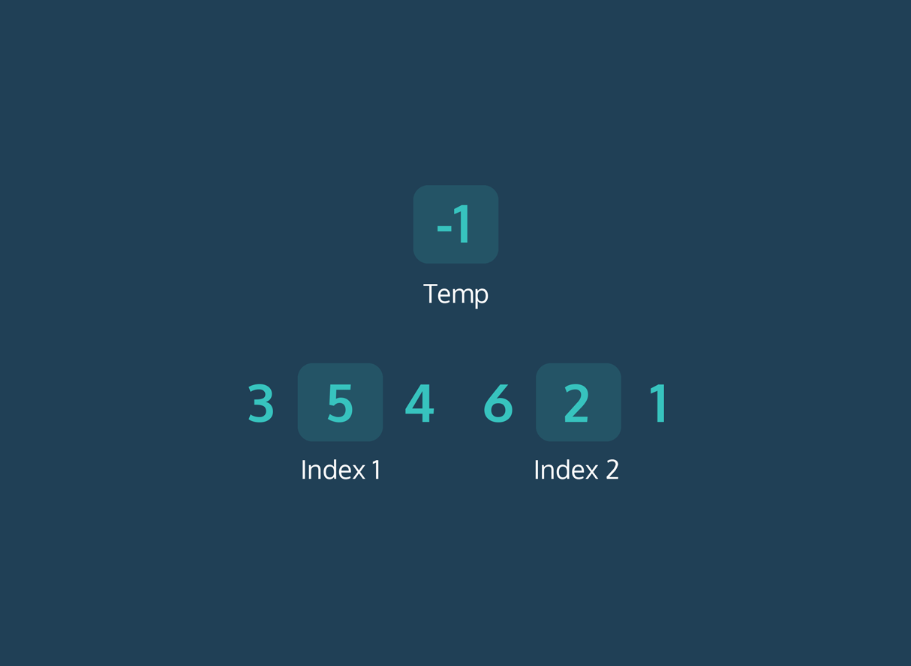

# Bubble Sort
# Bubble Sort: JavaScript

## Intro to Bubble Sort
Preparing for interviews will require you to become comfortable with implementing and discussing various algorithms. In particular, sorting algorithms, or algorithms that order elements in an array in a particular way, can be a popular topic. One example of a sorting algorithm is bubble sort.

The bubble sort algorithm takes an array of elements and reorders the elements of the input from smallest to largest. To achieve this, bubble sort works by comparing a pair of neighboring elements and swapping their positions in the array so that the larger of the two elements is always on the right. Doing this continuously results in the largest element “bubbling” up to the end of the array, giving this sort its name. The algorithm only stops when there are no more values that need to be swapped.

Below is a quick pseudocode example of what we will create in this lesson:
```
while array is not sorted
  for each value in array
    if current value > next value
      swap current value and next value

return array 
```

Bubble sort is not the most efficient sorting algorithm. Bubble sort’s worst-case runtime is O(n^2). This is because we have to compare the current element we are looking at, to each element in the array after it and repeat this check for every single element in the array. Its best-case runtime is O(n) for an already-sorted list.

## Loops
In order to sort an array, we’ll need to visit pairs of elements and check if they should be moved or kept at their current index. To accomplish this we’ll use two loops:
* One loop that will execute an inner loop depending on the state of a variable representing whether the input array might be sorted or not
* An inner loop to compare and swap pairs of elements in the array

### Exercises
1. Begin by taking a look at the bubbleSort() function given to you in bubbleSort.js. Note that it takes one argument, an array to be sorted.

    To start sorting, we will use a variable to store the condition of the input array as a Boolean value: true, meaning our input array might still be unsorted and need additional swaps of elements and we’ll later change it to false, meaning the input array does not need anymore swapping to sort it.

    Add a variable inside bubbleSort() called swapping and assign it the value true.
2. Below the line where you declared swapping, create a while loop. This is the outer loop of our program that only runs if the input array might not be sorted and needs swapping, (the condition stored in swapping).

    Use swapping which is currently set to true as the while condition.

    This ensures that we’ll start running the while loop and run it at least once, since we need to loop through the input array at least one time to determine if it’s already sorted or needs swapping.
3. If we find that we don’t need to swap any of the elements, it means that the array is already sorted from smallest to largest and we can stop running our code and return the sorted array. To stop our while loop we only need to change the while condition to false.

    Inside of the while loop we created, set swapping to false.

    (We’ll add code later that will restart the loop if we might have to keep swapping to “bubble up” elements to the end of the array.)
4. Create a for loop nested inside the while loop under the line where you reassigned the value of swapping.

    The for loop should visit every element in the input array starting from the first element and stopping at the second-to-last element. Setting the condition for the loop this way allows us to stay within the bounds of our input array and only check elements that exist.

    Since the index is going to change, make sure to make it a let variable.
5. Lastly, bubbleSort() should return a sorted input array, (we’ll do the actual sorting in a later exercise).

    Add code to return the sorted input array if we’ve exited our while loop.

`bubbleSort.js`
```JS
const swap = require('./swap');

const bubbleSort = input => {
  // 1.
  let swapping = true;
  // 2.
  while (swapping) {
    // 3.
    swapping = false;
    // 4.
    for (let i = 0; i < input.length - 1; i++) {
      // 5.
      return input;
    };
  };
};

module.exports = bubbleSort;
```

## Swap
An essential part of bubble sort is the “swapping” of pairs of unsorted elements. This animation illustrates how the swap() function of the bubble sort algorithm should work:



To swap pairs of elements, we’ll need to store one of the values at either index in a temporary variable so we can use it later. For example, doing something like this:
```JS
currentValue = nextValue;
nextValue = currentValue;
```

would not work because we’d “lose” one of the values. The original value of currentValue would be overwritten and there would be no reference to it. Using the temporary variable strategy seen in the GIF above avoids the loss of any of the values whose position we need to exchange.

We’ll employ this strategy to finish building out swap().

### Exercises
1. Take a moment to look at the helper function in swap.js. Notice that swap() takes 3 arguments: the input array, the index of the current element, and finally, the index of the next element in the input array.

    Create a constant called temp and store the value of the element at the indexTwo position in the input array so it can be referenced later.
2. Change the element at indexTwo of the input array to the value of the element at indexOne.
3. Change the element at indexOne of the input array to the original value of the element at indexTwo.

`swap.js`
```JS
const swap = (arr, indexOne, indexTwo) => {
  // 1.
  const temp = arr[indexTwo];
  // 2.
  arr[indexTwo] = arr[indexOne];
  // 3.
  arr[indexOne] = temp;
}

module.exports = swap;
```

## Compare
We have a loop to run our algorithm, and another that visits each element in the input array but if we were to run this as is, it would only iterate through the array once.

Let’s add some additional logic to our code in the bubbleSort.js file that will compare neighboring elements and swap them if necessary. For this exercise, you’ll only be adding code inside of the for loop of bubbleSort().

### Exercises
1. Inside of the for loop we added, create a conditional that checks if the element at the current index is greater than the element one index after it.
2. Let’s begin adding the logic for the swapping action. To see how we’re changing our input array by swapping elements, add the following inside of the if statement you created:
    ```JS
    console.log(`Swapping pair ${input[i]}, ${input[i+1]} in [${input}]`);
    ```

    This code will log a message for every swap made when we execute bubbleSort().
3. Swap unordered pairs. After our logging statement, add a call to swap(), the helper function that handles changing the position of pairs of elements. Take a look at the parameters of swap() in the swap.js file to see what arguments you need to call it with.
4. If we make a swap, we want to loop through the array again to see if we need to make additional swaps to continue “bubbling up” elements in the wrong position.

    Keep our while loop running by changing the value of the while condition variable so that it evaluates as true.
```JS
const swap = require('./swap');

const bubbleSort = input => {
  let swapping = true;
  
  while (swapping) {
    swapping = false;
    for (let i = 0; i < input.length - 1; i++) {
      // 1.
      if (input[i] > input[i +1]) {
        // 2.
        console.log(`Swapping pair ${input[i]}, ${input[i+1]} in [${input}]`);
        // 3.
        swap(input, i, i + 1);
        // 4.
        swapping = true;
      };
    }
  }
  return input;
};

module.exports = bubbleSort;
```

## Review
Excellent work! You’ve successfully implemented your first sorting algorithm.

### Exercises
1. Test your work by calling bubbleSort() with each of the arrays below and logging the results:
    ```JS
    [9, 8, 7, 6, 5, 4, 3, 2, 1] 
    [1, 2, 3, 4, 5, 6, 7, 8, 9]
    ```

    Notice how your implementation of bubble sort handles swapping elements in these two arrays. Do the number of swaps differ between the two arrays? Why would that be?
2. What real-life examples of bubble sort can you come up with?
3. Can you think of an input array that would result in an O(n^2) runtime? What input array would result in an O(n) runtime?

`swap.js`
```JS
const swap = (arr, indexOne, indexTwo) => {
  const temp = arr[indexTwo];
  arr[indexTwo] = arr[indexOne];
  arr[indexOne] = temp;
};

module.exports = swap;
```
`bubbleSort.js`
```JS
const swap = require('./swap');

const bubbleSort = input => {
  let swapCount = 0
  let swapping = true;
  
  while (swapping) {
    swapping = false;
    for (let i = 0; i < input.length - 1; i++) {
      if (input[i] > input[i + 1]) {
        swap(input, i, i + 1);
        swapCount++;
        swapping = true;
      }
    }
  }
  console.log(`Swapped ${swapCount} times`);
  return input;
};

// 1.
bubbleSort([9, 8, 7, 6, 5, 4, 3, 2, 1]);
bubbleSort([1, 2, 3, 4, 5, 6, 7, 8, 9]);

module.exports = bubbleSort;
```
```
Swapped 36 times
Swapped 0 times
```
