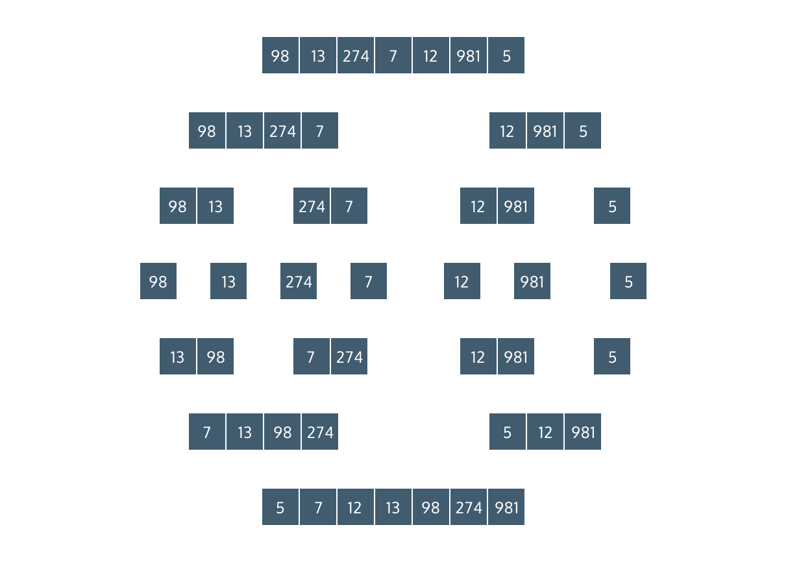

# Merge Sort
# Merge Sort: JavaScript

## Introduction
In this lesson, you will learn how to implement the merge sort algorithm in JavaScript. The algorithm consists of two distinct steps:
* Splitting the input array – The algorithm recursively splits the input array until each element is in its own array. This portion of the algorithm is represented in the top half of the image to the right.
* Merging sorted arrays – The algorithm compares and combines the elements of arrays until the input array is sorted. This is shown in the bottom half of the image.



## Splitting: Base Case
In this implementation of merge sort, you will build a recursive function, called mergeSort(), that splits the input array until each element is in its own array.

So, if the input array is:
```
[3, 5, 2]
```

splitting these elements into their own arrays will look like:
```
[3]
[5]
[2]
```

The base case of this recursive function is when the input array has only one element in it. Below is a pseudocode implementation of the base case:
```
function mergeSort(arr)
  if the length of arr equals 1
    return arr
```

### Exercises
1. In mergeSort(), add a line that saves the length of startArray to a constant called length.
2. Add an if statement that checks if length is equal to 1. If it is, return startArray.
```JS
const mergeSort = (startArray) => {
  // 1.
  const length = startArray.length;
  // 2.
  if (length === 1) return startArray;
}

const inputArr = [3];

console.log(mergeSort(inputArr));

module.exports = {
  mergeSort
};
```
```
[ 3 ]
```

## Splitting: Recursive Case
The recursive case of our mergeSort() function requires that we first split the input array into a leftArray and rightArray:
```
function mergeSort(arr)
  if the length of arr equals 1
    return arr

  midIndex = the floor integer of (left + right) / 2
  leftArr = arr from 0 to midIndex
  rightArr = arr from midIndex to end
```

In the example above, the leftArray is equal to the input arr from 0 to the middle index. The right array is from the middle index to the end.

Next, we pass the left and right arrays into the mergeSort() function:
```
function mergeSort(arr)
  if the length of arr equals 1
    return arr

  midIndex = the floor integer of (left + right) / 2
  leftArray = arr from 0 to midIndex
  rightArray = arr from midIndex to end

  mergeSort(leftArray)
  mergeSort(rightArray)
```

This is our recursive call.

### Exercises
1. Create a constant variable called mid and set it equal to the floor of length / 2.
2. Now you are going to create the left and right arrays.

    Create a variable called leftArray and set it equal to a new array of elements from startArray, from 0 to mid.

    Create a variable called rightArray and set it equal to the elements of startArray from mid to length.
3. On two separate lines, pass leftArray into mergeSort() and rightArray into mergeSort().

    We added a console.log() statement to the if block, so you should see each element of the input array ([3, 5, 2, 90, 4, 7]) printed to the console when you run your code.
```JS
const mergeSort = (startArray) => {
  const length = startArray.length;
  if (length === 1) {
    console.log(startArray);
    return startArray;
  }
  // 1.
  const mid = Math.floor(length / 2);
  // 2.
  const leftArray = startArray.slice(0, mid);
  const rightArray = startArray.slice(mid, length);
  // 3.
  mergeSort(leftArray);
  mergeSort(rightArray);
}

const inputArr = [3, 5, 2, 90, 4, 7];

console.log(mergeSort(inputArr));

module.exports = {
  mergeSort
};
```
```
[ 3 ]
[ 5 ]
[ 2 ]
[ 90 ]
[ 4 ]
[ 7 ]
undefined
```

## Call merge() from mergeSort()
At this point, we have a function that recursively splits the input array until each element is in a single-element array. The final step is to call the function that is responsible for merging the leftArray and rightArray.
```
function mergeSort(arr)
  if the length of arr equals 1
    return arr

  midIndex = the floor integer of (left + right) / 2
  leftArray = arr from 0 to midIndex
  rightArray = arr from midIndex to end

  return merge(mergeSort(leftArray), mergeSort(rightArray))
```

In the last line of the pseudocode, we call a function named merge(). In the next exercise, you will implement a merge() function that combines the sorted leftArray and rightArray halves into a larger sorted array.

### Exercise
1. We added a merge() function to index.js that prints leftArray and rightArray to the console.

    In mergeSort() return a call to merge(). Pass mergeSort(leftArray) and mergeSort(rightArray) as the first and second arguments.
```JS
const mergeSort = (startArray) => {
  const length = startArray.length;
  if (length === 1) {
    return startArray;
  }
  
  const mid = Math.floor(length / 2);
  const leftArray = startArray.slice(0, mid);
  const rightArray = startArray.slice(mid, length);
  // 1.
  return merge(mergeSort(leftArray), mergeSort(rightArray));  
}

const merge = (leftArray, rightArray) => {
  console.log(leftArray);
  console.log(rightArray);
}

const inputArr = [3, 5, 2, 90, 4, 7];

console.log(mergeSort(inputArr));

module.exports = {
  mergeSort
};
```
```
[ 5 ]
[ 2 ]
[ 3 ]
undefined
[ 4 ]
[ 7 ]
[ 90 ]
undefined
undefined
undefined
undefined
```

## Merging
Now, let’s turn our attention to the merge() function. First, let’s think about its arguments and what it returns:
* Arguments: two sorted lists as inputs (leftArray and rightArray)
* Returns: a sorted list with the elements of leftArray and rightArray combined. We will call this new array sortedArray

Let’s break the implementation of this function into three parts:
* Create a while loop that continues while there are still elements in leftArray and rightArray.
```
function merge(leftArray, rightArray)
  sortedArray = []
  while leftArray and rightArray have a length greater than 0
    // Do something

  return sortedArray
```

* Create conditions that adds an element to sortedArray with each loop.
```
function merge(leftArr, rightArr)
  sortedArray = []
  while leftArray and rightArray have a length greater than 0
    if leftArray[0] is less than rightArray[0]
      push leftArray[0] onto sortedArray
      remove leftArray[0] from leftArray
    else 
      push rightArray[0] onto sortedArray
      remove rightArray[0] from rightArray
```

This code will add the smaller number, between leftArray[0] and rightArray[0] to the new array. Then, it will remove that number from the array.
* Return sortedArray, with leftArray and rightArray concatenated.
```
function merge(leftArr, rightArr)
  sortedArray = []
  while leftArray and rightArray have a length greater than 0
    if leftArray[0] is less than rightArray[0]
      push leftArray[0] onto sortedArray
      remove leftArray[0] from leftArray
    else 
      push rightArray[0] onto sortedArray
      remove rightArray[0] from rightArray


  return sortedArray with leftArray and rightArray concatenated
```

Because the while loop continues until either leftArray or rightArray is empty, you need to concatenate whatever is left in the other array to the sorted array. In JavaScript, it’s easiest to implement this by concatenating both arrays, because the empty array will not alter the original.

### Exercise
1. You will implement the entire merge() function in this checkpoint. Follow the steps below to do so:
1. Implement a while loop that continues until leftArray and rightArray are empty.
2. Add an if statement that checks if leftArray\[0] is less than rightArray\[0]. If it is, append that number to sortedArray and remove it from leftArray
3. Add an else statement that appends rightArray\[0] to sortedArray and then removes that number from rightArray.
4. Once the while loop has completed, return the sortedArray with leftArray and rightArray concatenated.
```JS
const mergeSort = (startArray) => {
  const length = startArray.length;
  if (length === 1) {
    return startArray;
  }
  
  const mid = Math.floor(length / 2);
  const leftArray = startArray.slice(0, mid);
  const rightArray = startArray.slice(mid, length);

  return merge(mergeSort(leftArray), mergeSort(rightArray))
}

const merge = (leftArray, rightArray) => {
  const sortedArray = [];
  // 1.
  while (leftArray.length > 0 && rightArray.length > 0) {
    // 2.
    if (leftArray[0] < rightArray[0]) {
      sortedArray.push(leftArray[0]);
      leftArray.shift();
      // 3.
    } else {
      sortedArray.push(rightArray[0]);
      rightArray.shift();
    }
  }
  // 4.
  return sortedArray.concat(leftArray).concat(rightArray);
}


const inputArr = [3, 5, 2, 90, 4, 7];

console.log(mergeSort(inputArr));

module.exports = {
  mergeSort
};
```
```
[ 2, 3, 4, 5, 7, 90 ]
```

## Review
Nice work building your own mergeSort() function. An important point to remember about merge sort is that the algorithm is broken into two parts: splitting and merging.

Regardless of the order or length (including odd or even lengths) of an input array, the merge sort algorithm will always split the elements into their own arrays first, and then combine them into a sorted array. The fact that the same steps are taken regardless of the input (order and length) results in an average, best, and worst case complexity all equal to the same value, O(n log n).

This time complexity makes merge sort one of the most efficient and popular sorting algorithms. Take a look at merge sort compared to a few others on [toptal.com](https://www.toptal.com/developers/sorting-algorithms).
