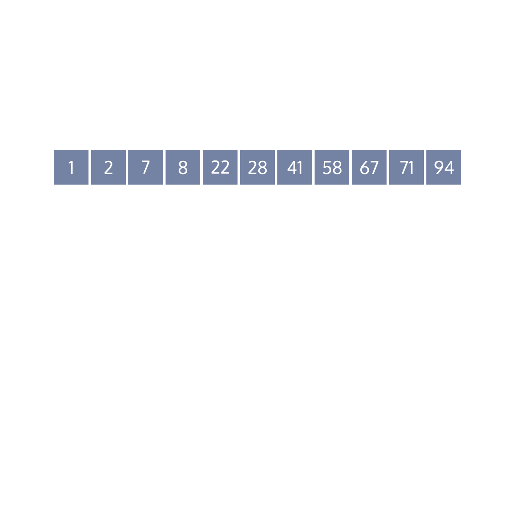
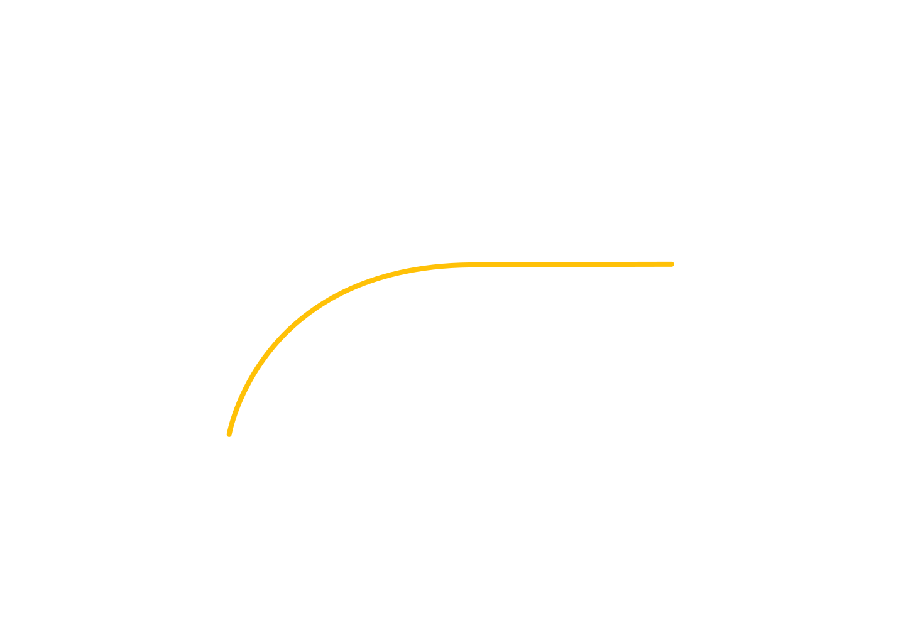

# Binary Search and Search Trees
# Binary Search: Conceptual

## Learn Binary Search
With a sorted data-set, we can take advantage of the ordering to make a sort which is more efficient than going element by element.

Let’s say you were looking up the word “Telescope” in the dictionary. You wouldn’t flip through the “A” words and “B” words, page by page, until you got to the page you wanted because you know “T” is near the end of the alphabet.

You might flip it open near the end and see “R” words. Maybe then you jump ahead and land at “V” words. You would then go slightly backward to find the “T” words.

At each point, you knew to look forward or backward based on the ordering of the alphabet. We can use this intuition for an algorithm called binary search.

Binary search requires a sorted data-set. We then take the following steps:
* Check the middle value of the dataset.
  * If this value matches our target we can return the index.
* If the middle value is less than our target
  * Start at step 1 using the right half of the list.
* If the middle value is greater than our target
  * Start at step 1 using the left half of the list.

We eventually run out of values in the list, or find the target value.

## Time Complexity of Binary Search
How efficient is binary search?

In each iteration, we are cutting the list in half. The time complexity is O(log N).

A sorted list of 64 elements will take at most log2(64) = 6 comparisons.

In the worst case:
* Comparison 1: We look at the middle of all 64 elements
* Comparison 2: If the middle is not equal to our search value, we would look at 32 elements
* Comparison 3: If the new middle is not equal to our search value, we would look at 16 elements
* Comparison 4: If the new middle is not equal to our search value, we would look at 8 elements
* Comparison 5: If the new middle is not equal to our search value, we would look at 4 elements
* Comparison 6: If the new middle is not equal to our search value, we would look at 2 elements

When there’s 2 elements, the search value is either one or the other, and thus, there is at most 6 comparisons in a sorted list of size 64.

