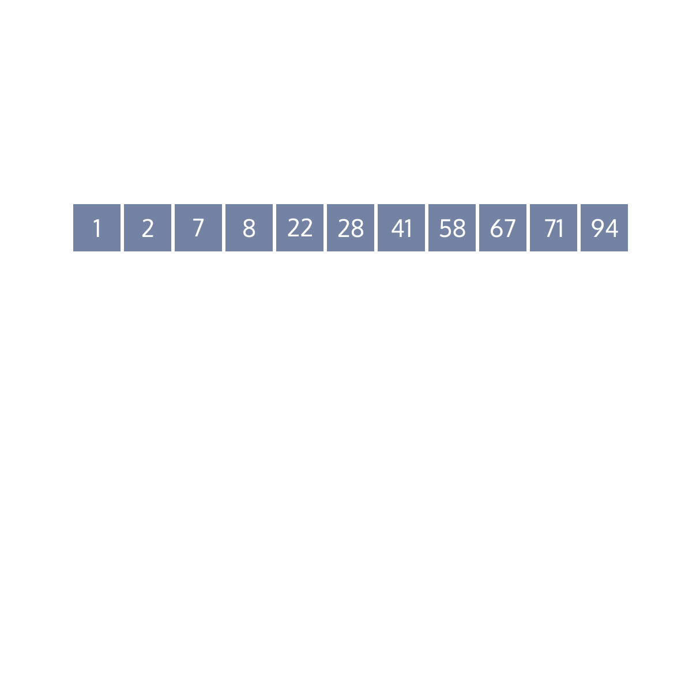
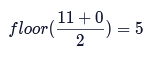

# Binary Search and Search Trees
# Binary Search: JavaScript

## Iterative Binary Search
In this lesson, you will implement an iterative binary search function in JavaScript.

The function will:
* Accept an array of numbers and a value as arguments
* Return the index of the value if it is present in the array
* Return null if a value is not in the array

You will test your function by inputting the array shown in the gif to the right as an argument. By the end of this lesson, the following JavaScript code will print 6 to the console.
```JS
const searchable = [1, 2, 7, 8, 22, 28, 41, 58, 67, 71, 94];
const target = 41;

console.log(binarySearch(searchable, target)) // 6
```

In the code above, also shown visually to the right, we use the binarySearch() function to find the index in searchable that is equal to 41. The index is 6.



## Finding the Middle Index
A key step in each binary search iteration is to find the middle value of the current list context. In practice, we do this by tracking the first and last indices, then finding their average.

The first index we check will always be the middle value of the original list. Because of this, we start by setting the following first (left) and last (right) indices. Below, we show a pseudocode example of how to set these variables.
```
function binarySearch (arr, target)
  left = 0
  right = length of arr
  . . .
```

We could call a JavaScript implementation of this function with the following code:
```JS
const searchable = [1, 2, 7, 8, 22, 28, 41, 58, 67, 71, 94];
const target = 41;
 
console.log(binarySearch(searchable, target))
```

Because we pass in an array of length 11, the right variable is set to 11.

Next, we calculate the middle index of the array:
```
function binarySearch (arr, target)
  left = 0
  right = length of arr

  indexToCheck = the floor integer of (left + right) / 2
  . . .
```

The above function will calculate the middle index of the array by calculating the average of right and left and rounding it to the floor integer. Given left is zero and right is 11:



So, the first index the function checks is 5.

Now you know how to calculate the first indexToCheck. In the next exercise, you will implement an approach to check whether the value at that index is equal to the target.

### Exercises
1. Create a let named left and set it equal to 0.

    Create a let named right and set it equal to the length of arr.
2. Create a const called indexToCheck and set it equal to the floor integer of the average of left and right.

    Return indexToCheck. You should see 5 printed to the console.
```JS
const binarySearch = (arr, target) => {
  // Add left and right variables below
  // 1.
  let left = 0;
  let right = arr.length;
  
  // Add indexToCheck calculation below
  // 2.
  const indexToCheck = Math.floor((left + right) / 2);
  return indexToCheck;
}

const searchable = [1, 2, 7, 8, 22, 28, 41, 58, 67, 71, 94];
const target = 28;

console.log(binarySearch(searchable, target));
```

## Checking the Middle Index
Let’s consider how to implement an approach to check whether the value at indexToCheck is equal to the target value. Below, we use pseudocode to display two additional steps that will check if the target value is found.
```
function binarySearch (arr, target)
  left = 0
  right = length of arr

  indexToCheck = the floor integer of (left + right) / 2

  checking = value of arr at indexToCheck

  if checking is the target
    return indexToCheck
```

In the example above, we set a variable called checking to the value in arr at the position indexToCheck. Then, we return the index if it is equal to the target value.

### Exercises
1. Create a constant called checking and set it equal to the value at indexToCheck.
2. Create an if statement that returns indexToCheck if checking is equal to target. If your solution is implemented correctly, the script should log 5 to the console.
```JS
const binarySearch = (arr, target) => {
  let left = 0;
  let right = arr.length;
  
  const indexToCheck = Math.floor((left + right) / 2);
  // 1. Create a constant called checking
  const checking = arr[indexToCheck];

  // 2. Create a conditional below
  if (checking === target) return indexToCheck;

  return null;
}

const searchable = [1, 2, 7, 8, 22, 28, 41, 58, 67, 71, 94];
const target = 28;

console.log(binarySearch(searchable, target));
```
```
5
```

## Iterative Checking
At this point, you have a function that checks the middle index of an input array and returns the index if the value equals target. Let’s consider how to extend the function to iteratively check sublists when the middle value is not equal to target.

Remember back to our algorithm, the function continues to execute until the left and right indices converge or the target is found. In practice, we can implement this with the following while condition.
```
while right is greater than left
 indexToCheck = the floor integer of (left + right) / 2 
 checking = value of arr at indexToCheck

 if checking is the target
   then return indexToCheck
```

Unfortunately, the above code will execute infinitely because our right and left variables do not converge from one iteration to the next. To address this issue, in addition to checking if the current value is the target value, we need to adjust the right or left index with each iteration.
```
while right is greater than left
  indexToCheck = the floor integer of (left + right) / 2 
  checking = value of arr at indexToCheck

  if checking is the target
    then return indexToCheck
  if target is greater than checking
    then set left to indexToCheck + 1
  else
    set right to indexToCheck
```

In the above code, we set the left or right index to a new value based on whether target is greater than or less than checking. The above while loop will continue to execute until the left index is greater than the right index.

In the checkpoints below, you will add conditions that change the left or right index based on whether checking is greater than or less than target. With each iteration, the distance from left to right will halve.

### Exercises
1. WARNING: Refresh the page if you create an infinite loop while implementing the solution.

    Add a condition to the while loop so it continues to execute while right is greater than left.
2. Add else if and else blocks that set new values to left or right based on a comparison of target and checking.
3. Change target, at the bottom of index.js to another value in the searchable array to see if your loop returns the correct index.
```JS
const binarySearch = (arr, target) => {
  let left = 0;
  let right = arr.length;
  
  // 1.
  while (right > left) {
    const indexToCheck = Math.floor((left + right) / 2);
    const checking = arr[indexToCheck];
    console.log(`indexToCheck equals: ${indexToCheck}`)
  
    if (checking === target) {
      return indexToCheck;
    } // Add else if and else blocks:
    // 2.
      else if (target > checking) {
        left = indexToCheck + 1;
      } else {
        right = indexToCheck;
      };
     
  }
  return null;
}

const searchable = [1, 2, 7, 8, 22, 28, 41, 58, 67, 71, 94];
const target = 94;

const targetIndex = binarySearch(searchable, target);

console.log(`The target index is ${targetIndex}.`);
```
```
indexToCheck equals: 5
indexToCheck equals: 8
indexToCheck equals: 10
The target index is 10.
```

## Review
In this lesson, you learned how to implement an iterative binary search solution. The function returns the index of the target value from a sorted list. If the target value is not found, the function returns null. You used the following steps to create this function:
* Initialize the left and right indices as 0 and the length of the array.
* Create a while loop that continues to execute until the left index equals the right index.
* Get the value at the index that falls in the middle of left and right.
* Return the index if the value is equal to target.
* Set left equal to the current index plus one if the target is greater than the value.
* Set right equal to the current index if the target is less than the value.

While the benefits of binary search are significant compared to linear search, it’s important to remember that the function will only work on sorted lists.
