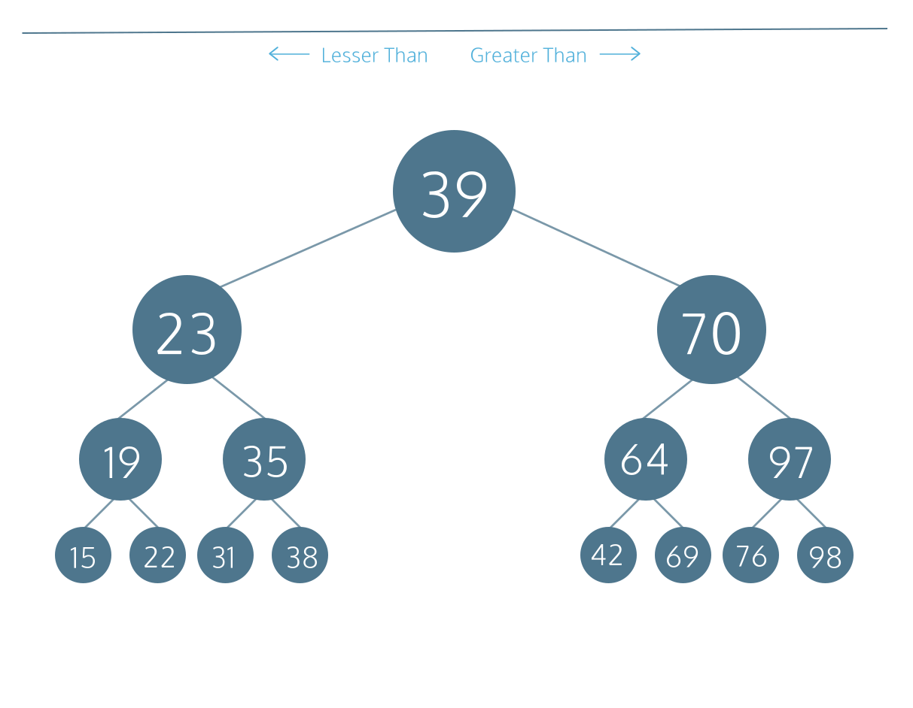

# Binary Search and Search Trees
# Binary Search Trees: JavaScript

## Introduction
A binary tree is an efficient data structure for fast data storage and retrieval due to its O(log N) runtime. It is a specialized tree data structure that is made up of a root node, and at most two child branches or subtrees. Each child node is itself a binary tree.

Each node has the following properties:
* data
* a depth value, where depth of 1 indicates the top level of the tree and a depth greater than 1 is a level somewhere lower in the tree
* a left pointer that points to a left child which is itself a binary tree, and must have a data lesser than the root node’s data
* a right pointer that points to a right child which is itself a binary tree, and must have a data greater than the root node’s data



### Exercises
1. We have provided an empty BinaryTree class in BinaryTree.js.
    * Define a constructor that takes two parameters: value and depth where value is the data contained within a binary tree and depth indicates the level of the tree
    * Assign a default depth of 1 to depth in the parameter list
    * Declare an instance property, value, and assign this to the parameter value.
    * Declare another instance property, depth, and assign this to the parameter depth.
2. Define left and right instance properties to represent pointers to the left and right binary tree nodes and assign each one to null.
3. Open up script.js. Instantiate a BinaryTree class with an initial value of 15 and assign it to a const variable bt.

    Display the content of the binary tree, bt.

`BinaryTree.js`
```JS
class BinaryTree {
  // 1.
  constructor(value, depth = 1) {
    this.value = value;
    this.depth = depth;
    // 2.
    this.left = null;
    this.right = null;
  }
};

module.exports = BinaryTree;
```
`script.js`
```JS
const BinaryTree = require('./BinaryTree');

// create a BinaryTree here
// 3.
const bt = new BinaryTree(15);
console.log(bt);
```
```
BinaryTree { value: 15, depth: 1, left: null, right: null }
```

## Inserting a Value
When inserting a new value into a binary tree, we compare it with the root node’s value:
```
If the new value is less than the root node's value
  If a left child node doesn't exist 
    Create a new BinaryTree with the new value at a greater depth and assign it to the left pointer
  Else
    Recursively call .insert() on the left child node  
Else
  If a right child node doesn't exist
    Create a new BinaryTree with the new value at a greater depth and assign it to a right pointer
  Else
    Recursively call .insert() on the right child node
```

Let’s illustrate the insertion procedure with a tree whose root node has the data 100.
```
Insert 50
50 < 100, left child node doesn't exist, create a left child node
       100
       /
     50 
Insert 125
125 > 100, right child node doesn't exist, create a right child node
        100
       /   \
      50    125
Insert 75
75 < 100, left child node of 50 exists, recursive insert at left child
75 > 50, right child node doesn't exist, create a right child node
        100
       /   \
      50    125
       \
       75 
Insert 25
25 < 100, left child node of 50 exists, recursive insert at left child
25 < 50, left child node doesn't exist, create a left child node
        100
       /   \
      50    125
     /  \
    25  75
```

### Exercises
1. Define a method, .insert(), with a parameter, value, below the constructor.
2. We want to know where to place the target value. If the target value is less than the root node’s value, we will need to place it in a left child node. Before doing so, we need to check if a left child node already exists. If so, we will call the .insert() method for the left child node. If not, we will add another level to our binary tree by creating a left binary tree with the target value and a new depth.
    * Write an outer if else statement block.
        * The if statement should check if the target value is less than the root node’s value.
        * The else statement should be left blank for now.

    * Inside the outer if statement block, write an inner if else statement block.
        * The if statement should check if a left child node exists
            * If it exists, call its .insert() method passing on value
            * If it doesn’t exist, instantiate a BinaryTree with the target value and a new depth and assign it to the left pointer
        * The else statement should be left blank for now.
3. Alternatively, if the target value is not less than the root node’s value, then we will place it in the right child node. Before doing so, we need to check if a right child node already exists. If so, we will call the .insert() method of the right child node. If not, we will add another level to our binary tree by creating a right binary tree with the target value and a new depth.
    * Inside the outer else statement block from the previous step, write an if statement that checks if a right child node exists
      * If it exists, call its .insert() method passing on value
      * If it doesn’t exist, instantiate a BinaryTree with the target value and a new depth and assign it to the right pointer
4. Open up script.js. A default BinaryTree has been created for you with an initial value of 100. Insert the following values to the tree in this order:
    * 50
    * 125
    * 75
    * 25

    Display the content of this tree and study the terminal output. The result should match the tree illustration in the lesson.

`BinaryTree.js`
```JS
class BinaryTree {
  constructor(value, depth = 1) {
    this.value = value;
    this.depth = depth;
    this.left = null;
    this.right = null;
  }
  // 1.
  insert(value) {
    if (value < this.value) {
      if (!this.left) {
        this.left = new BinaryTree(value, this.depth + 1);
      } else {
        this.left.insert(value);
      };
    } else {
      // 3.
      if (!this.right) {
        this.right = new BinaryTree(value, this.depth + 1);
      } else {
        this.right.insert(value);
      };
    };
  }
};

module.exports = BinaryTree;
```
`script.js`
```JS
const BinaryTree = require('./BinaryTree');

// create a BinaryTree here
const bt = new BinaryTree(100);

// insert values to the BinaryTree here
// 4.
bt.insert(50);
bt.insert(125);
bt.insert(75);
bt.insert(25);
console.log(bt)
```
```
BinaryTree {
  value: 100,
  depth: 1,
  left: 
   BinaryTree {
     value: 50,
     depth: 2,
     left: BinaryTree { value: 25, depth: 3, left: null, right: null },
     right: BinaryTree { value: 75, depth: 3, left: null, right: null } },
  right: BinaryTree { value: 125, depth: 2, left: null, right: null } }

```

## Retrieve a Node by Value
Recall that a binary search tree provides a fast and efficient way to store and retrieve values. Like with .insert(), the procedure to retrieve a tree node by its value is recursive. We want to traverse the correct branch of the tree by comparing the target value to the current node’s value.

The base case for our recursive method is that when the values match, we return the current node. The recursive step is to call itself from an existing left or right child node with the value.
```
If target value is the same as the current node value
  Return the current node
Else
  If target value is less than the root node's value and there is a left child node
    Recursively search from the left child node
  Else if there is a right child node
    Recursively search from the right child node
```

Given the following tree:
```
        100
       /   \
      50    125
     /  \
    25  75
```

To retrieve 75, the algorithm would proceed as follows:
```
At root node, 75 < 100 and there is a left child

        100
       /   \
 ==>  50    125
     /  \
    25  75

At the node 50, 75 > 50 and there is a right child

        100
       /   \
      50    125
     /  \
    25  75 <== 

Node 75 = 75, return this node
```

### Exercises
1. Define a new method, .getNodeByValue(), below the .insert() method that takes one parameter, value.
2. The first thing we do is to compare the target value with the root node’s value. If they are the same, return the node. This is the base case.
3. If the target value cannot be found in the root node, we want to navigate further down the binary tree. We start with the left child node if it exists and recursively search in the left subtree. To traverse the left tree, we need to make sure the target value is less than the root node’s value.

    Write an else if statement that checks:
    * if the left child node exists, and
    * if the target value is less than this.value

    Inside the else if block, return with a call to .getNodeByValue() method of the left child node.
4. Next, we want to implement the recursive step for the right child node if it exists.

    Write an else if block that:
    * checks if the right child node exists, and
    * return with a call to .getNodeByValue() method for the right child node if it exists
5. If the target value does not exist in the binary tree, we should return null.

    Create an else block that returns null.
6. Open up script.js. Search for the value 75 in the BinaryTree object already created for you and display the contents of the returned tree node.

    Search for a non-existent value of 55 in the same BinaryTree object and display the returned value.

`BinaryTree.js`
```JS
class BinaryTree {
  constructor(value, depth = 1) {
    this.value = value;
    this.depth = depth;
    this.left = null;
    this.right = null;
  }
  
  insert(value) {
    if (value < this.value) {
      if (!this.left) {
        this.left = new BinaryTree(value, this.depth + 1);
      } else {
        this.left.insert(value);
      }
    } else {
      if (!this.right) {
        this.right = new BinaryTree(value, this.depth + 1);
      } else {
        this.right.insert(value);
      }
    }
  }
  // 1.
  getNodeByValue(value) {
    // 2.
    if (value === this.value) {
      return this;
    }
    // 3.
      else if (this.left && value < this.value) {
        return this.left.getNodeByValue(value)
      }
      // 4.
      else if (this.right) {
        return this.right.getNodeByValue(value);
      }
      // 5.
      else {
        return null;
      };
  }
};

module.exports = BinaryTree;
```
`script.js`
```JS
const BinaryTree = require('./BinaryTree');

// create a BinaryTree
const bt = new BinaryTree(100);

// insert values to the BinaryTree
bt.insert(50);
bt.insert(125);
bt.insert(75);
bt.insert(25);

// 6.
console.log(bt.getNodeByValue(75));
console.log(bt.getNodeByValue(55));
```
```
BinaryTree { value: 75, depth: 3, left: null, right: null }
null
```

## Traversing a Binary Tree
There are two main ways of traversing a binary tree: breadth-first and depth-first. With breadth-first traversal, we begin traversing at the top of the tree’s root node, displaying its data and continuing the process with the left child node and the right child node. Descend a level and repeat this step until we finish displaying all the child nodes at the deepest level from left to right.

With depth-first traversal, we always traverse down each left-side branch of a tree fully before proceeding down the right branch. However, there are three traversal options:
* Preorder is when we perform an action on the current node first, followed by its left child node and its right child node
* Inorder is when we perform an action on the left child node first, followed by the current node and the right child node
* Postorder is when we perform an action on the left child node first, followed by the right child node and then the current node

For this lesson, we will implement the inorder option. The advantage of this option is that the data is displayed in a sorted order from the smallest to the biggest.

To illustrate, let’s say we have a binary tree that looks like this:
```
           15
     /------+-----\
    12            20
   /   \         /   \   
 10     13     18     22
 / \   /  \    / \   /  \
8  11 12  14  16 19 21  25
```

We begin by traversing the left subtree at each level, which brings us to 8, 10 and 11 reside. The inorder traversal would be:
```
8, 10, 11
```

We ascend one level up to visit root node 12 before we descend back to the bottom where the right subtree of 12, 13, and 14 resides. Inorder traversal continues with:
```
12, 12, 13, 14
```

We again ascend one level up to visit root node 15 before we traverse the right subtree starting at the bottom level again. We continue with the bottom leftmost subtree where 16, 18 and 19 reside. The inorder traversal continues with:
```
15, 16, 18, 19
```

We ascend one level up to visit root node 20 before we descend back to the bottom where the rightmost subtree of 21, 22 and 25 resides.

Traversal finishes with:
```
20, 21, 22, 25
```

The entire traversal becomes:
```
8, 10, 11, 12, 12, 13, 14, 15, 16, 18, 19, 20, 21, 22, 25
```

Notice that all the values displayed are sorted in ascending order.

### Exercises
1. Define the method, .depthFirstTraversal() below .getNodeByValue(). It takes no parameters.
2. Using inorder traversal, we will traverse the left child node followed by the root node and the right child node. Inside .depthFirstTraversal():
* Check to see if the left child node exists
* If it does, call this method on the left child node
3. We have just traversed the left subtree. Now we want to look at the root node. We can simply print out the data it contains and the tree level of the root node. Log the value of the root node to the console.
4. The next step would be to traverse the right subtree. Like in the step before last, we want to:
* Check to see if the right child node exists
* If it does, call this method on the right child node
5. Open up script.js and run it to display a depth-first traversal of a binary tree example described above.

`BinaryTree.js`
```JS
class BinaryTree {
  constructor(value, depth = 1) {
    this.value = value;
    this.depth = depth;
    this.left = null;
    this.right = null;
  }

  insert(value) {
    if (value < this.value) {
      if (!this.left) {
        this.left = new BinaryTree(value, this.depth + 1);
      } else {
        this.left.insert(value);
      }
    } else {
      if (!this.right) {
        this.right = new BinaryTree(value, this.depth + 1);
      } else {
        this.right.insert(value);
      }
    }
  }
  
  getNodeByValue(value) {
    if (this.value === value) {
      return this;
    } else if ((this.left) && (value < this.value)) {
        return this.left.getNodeByValue(value);
    } else if (this.right) {
        return this.right.getNodeByValue(value);
    } else {
      return null;
    }
  }
  // 1.
  depthFirstTraversal() {
    // 2.
    if (this.left) {
      this.left.depthFirstTraversal();
      // 3.
      console.log(`Depth=${this.depth}, Value=${this.value}`);
    }
    // 4.
    if (this.right) {
      this.right.depthFirstTraversal();
    }
  }

};

module.exports = BinaryTree;
```
`script.js`
```JS
const BinaryTree = require('./BinaryTree');
const randomize = () => Math.floor(Math.random() * 40);
const bt = new BinaryTree(15);
let numbers = [];

for (let i = 0; i < 10; i++) {
  numbers.push(randomize());
  bt.insert(numbers[i]);
}

console.log(`Inserted [ ${numbers} ] to binary tree`);

console.log('Depth First Traversal');
bt.depthFirstTraversal();
```
```
Inserted [ 34,4,5,19,20,21,27,7,11,9 ] to binary tree
Depth First Traversal
Depth=2, Value=4
Depth=3, Value=5
Depth=4, Value=7
Depth=6, Value=9
Depth=5, Value=11
Depth=1, Value=15
Depth=3, Value=19
Depth=4, Value=20
Depth=5, Value=21
Depth=6, Value=27
Depth=2, Value=34
```

