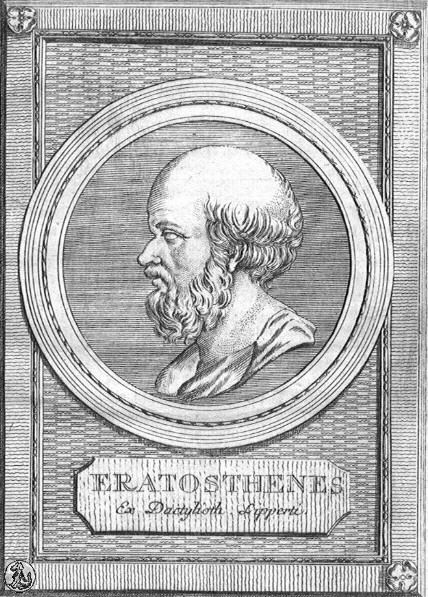
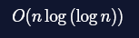
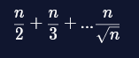
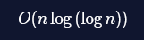

# JavaScript Algorithm Practice
# Sieve of Eratosthenes

The Sieve of Eratosthenes is one of the oldest-known algorithms, and it’s still helpful for deriving prime numbers! The algorithm is attributed to Eratosthenes, a Greek mathemetician born in the third century BCE.



The sieve provides a set of steps for finding all prime numbers up to a given limit. In this article, we’ll cover implementing the Sieve of Eratosthenes in JavaScript. As a reminder, a prime number is a positive number with no divisors but 1 and itself. 2, 3, 11, and 443 are all prime numbers.

## Sieve Implementation

The sieve works by first assuming that all numbers from

{2,…,n}

are prime, and then successively marking them as NOT prime.

The algorithm works as follows:
1. Create a list of all integers from 2 to n.
2. Start with the smallest number in the list (2, the smallest prime number).
3. Mark all multiples of that number up to n as not prime.
4. Move to the next non-marked number and repeat this process until the entire list has been covered.

When the steps are complete, all remaining non-marked numbers are prime.

## Implementation Steps in JavaScript
There are many possible ways of implementing this algorithm in JavaScript. We’ll outline a basic approach here and then walk through it step-by-step.
1. Create an array of all integers from 2 to n
2. Set all elements of the array to true
3. Starting with 2, iterate through the array. If the current element is true, it is still considered prime. Since we know that all multiples of that number are NOT prime, iterate through all multiples of that number up to n and set them equal to false
4. Change the current element to the next non-false index.
5. Return the corresponding number value for any element still marked as prime (value of true).

### Step One: Create the Array
First, we’ll create the array. In this case, we’ll create an array to represent all numbers up to the input limit, but we’ll use the array index to represent the number, and its value (true/false) to represent whether it is prime or not. The original algorithm said to use an array of 2, ..., n, but since we’re using indices to represent the actual number, we’ll start the array from 0 and essentially ignore the values of array\[0] and array\[1].

For example, after running our sieve, an array representing the primes up to 7 would look like this, with elements at \[2], \[3], \[5], and \[7] marked true:
```JS
[false, false, true, true, false, true, false, true]
```
```
Fill in the blanks of the sieveOfEratosthenes() function to create an array with the correct size and use the correct Array method to fill it with the value true. Mark the numbers 0 and 1 as non-prime.
```
```JS
const sieveOfEratosthenes = (limit) => {
  const output = new Array(limit + 1).fill(true);
  output[0] = false;
  output[1] = false;
};
```

## Step Two: Iterate
Now we’ll implement the bulk of the algorithm to iterate and mark numbers as non-prime. We’ll do this in two steps:
1. Create an outer loop to iterate from 2 to the limit.
2. Inside, check if the current number is still marked prime. If it is, we’ll mark all its multiples using another loop.
```
Implement the non-prime marking phase of the Sieve of Eratosthenes. For each number from 2 to the limit, check if it has not been already marked as non-prime. If it has not, mark all its multiples as non-prime.
```
```JS
const sieveOfEratosthenes = (limit) => {
  const output = new Array(limit + 1).fill(true);
  output[0] = false;
  output[1] = false;

  for (let i = 2; i <= limit; i++) {
    if (output[i] === true) {
      for (let j = i * 2; j <= limit; j = j + 1) {
        output[j] = false;
      };
    };
  };
};
```

### Step Three: Return Values
Now it’s time to pare down our array and only return the actual primes. There are many ways to do this, so we’re going to let you figure out an approach to this part of the algorithm isolated from the rest of the code.

#### Hint:
* Create a results array, iterate through the input array, and add the correct index if its value is true.
* Use a combination of .map() and .filter() to capture indices where the value is true and remove the rest.
* Use .reduce() and include the third optional index callback argument to construct a results array.
```
Complete the findTrueIndices() function. It should have a single parameter (an array), and return a new array of all indices in the input that are true.

For instance,

[false, false, true, true, false, true, false, true]

should return [2, 3, 5, 7].

You can assume that all array elements will be either true or false.
```
```JS
const findTrueIndices = (arr) => {
  const result = [];
  arr.forEach((value, index) => {
    if (value === true) {
      result.push(index);
    };
  });
  
  return result;
}


const test = findTrueIndices([false, false, true, true, false, true, false, true]);
// should return [2, 3, 5, 7]
console.log(test);

// Leave this line for testing:
module.exports = findTrueIndices;
```

### Complete Algorithm
Now it’s time to implement the complete algorithm! Try your hand at it and test it with multiple inputs (it may take a while to run if you call it with a very large input).
```
Implement the Sieve of Eratosthenes algorithm in JavaScript!

You can assume that your function is always called with a number. However, it should always return an array, even if there are no primes, so make sure to handle any edge case(s).

We’ve given you an example in the workspace along with the expected result. Run your code as you implement to see the results.
```
```JS
const sieveOfEratosthenes = (limit) => {
  if (limit < 2) return [];

  // create output array and fill it with true values
  const output = new Array(limit + 1).fill(true);
  // 0 & 1 marked as non-primes
  output[0] = false;
  output[1] = false;

  // Iterate up to the square root of the limit
  for (let i = 2; i <= limit; i++) {
    if (output[i] === true) {
      // Mark all multiples of i as non-prime
      for (let j = i * 2; j <= limit; j = j + i) {
        output[j] = false
      };
    };
  };

  // option 1:replace true values with the corresponding number value and filter out non-primes
  return output.reduce((primes, current, index) => {
    if (current) {
      primes.push(index);
    };

    return primes;
  }, []);
};

const test = sieveOfEratosthenes(13);
// should return [2, 3, 5, 7, 11, 13]
console.log(test);

// Leave this line for testing:
module.exports = sieveOfEratosthenes;
```

### Optimizations
There are several small optimizations that can be made to the basic implementation of the sieve to remove duplicate checks for prime-ness.

#### End Boundary
In our basic implementation, the outer loop iterated from 2 to n. Because the inner loop marks multiples of a base value, we only need to check individual numbers lower than the square root of n. Consider the example of a limit of 10:
1. First, all multiples of 2 are marked:

    2 3 <strike>4</strike> 5 <strike>6</strike> 7 <strike>8</strike> 9 <strike>10</strike>
2. Then, all multiples of 3 are marked:

    2 3 <strike>4</strike> 5 <strike>6</strike> 7 <strike>8</strike> <strike>9</strike> <strike>10</strike>
3. 4 is less than the square root of 10 (approximately 3.16), so we can break. If you look at the previous step, all non-prime numbers have indeed already been marked.

#### First Multiple
In our basic implementation, the inner loop started checking multiples at 2 times the current number. We can skip a few checks starting the checks at current2.

Consider the example of a limit of 10 again:
1. First, all multiples of 2 are marked:

    2 3 <strike>4</strike> 5 <strike>6</strike> 7 <strike>8</strike> 9 <strike>10</strike>
2. Then, all multiples of 3 are marked, but we can skip 6 (3 * 2) because it’s already been marked. Instead we start at 3<sup>2</sup>, 9:

    2 3 <strike>4</strike> 5 <strike>6</strike> 7 <strike>8</strike> <strike>9</strike> <strike>10</strike>
3. We’ve now completed the check with one less comparison.

#### Pre-mark All Even Numbers
This optimization comes in when building the initial array. There’s no need to ever check even numbers after 2, since they will never be prime, so they can all be marked as non-prime initially.

These optimizations may seem small when dealing with a limit of 10, but they can significantly speed up the algorithm with larger limits.

## Complexity
The complexity of the Sieve of Eratosthenes with optimizations is



There are two operations to take into account: the creation of the array and the incrementing and multiple-marking loops.

Creation happens in O(n) time, since it creates an element for each number from 2 to n.

Multiple marking happens in O(n log log n) time. The reasons for this come down to some complex math, but briefly:

The number of times you mark a non-prime number is



It begins with n / 2 because initially all multiples of 2 are marked as non-prime (this will happen 50 times with a limit of 100, as each even number is marked). This process continues up until the square root of n. Through some fancy mathematical proofs, this works out to an overall time complexity of



since this is larger than the O(n) array-creation time.

## Conclusion
The Sieve of Eratosthenes is a millennia-old algorithm, so there are some more improvements and more advanced methods for finding primes invented since its discovery, but it’s still a great way to generate lists of prime numbers. Included below is our sieve code including optimizations:
```JS
const sieveOfEratosthenes = (limit) => {
  // Handle edge cases
  if (limit <= 1) {
    return [];
  }
  // Create the output
  const output = new Array(limit + 1).fill(true);
  // Mark 0 and 1 as non-prime
  output[0] = false;
  output[1] = false;
 
  // Iterate up to the square root of the limit
  for (let i = 2; i < Math.pow(limit, 0.5); i++) {
    if (output[i] === true) {
      // Mark all multiples of i as non-prime
      for (let j = Math.pow(i, 2); j <= limit; j = j + i) {
        output[j] = false;
      }
    }
  }
 
  // Remove non-prime numbers
  return output.reduce((primes, current, index) => {
    if (current) {
      primes.push(index);
    }
    return primes
  }, []);
}
```
